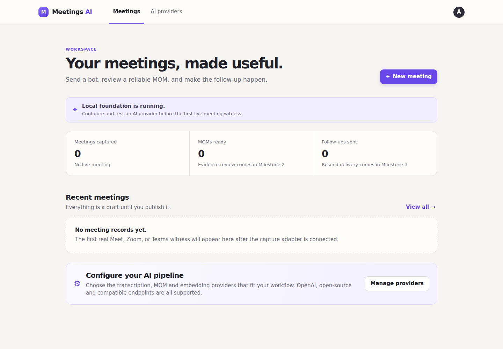

# Foundation verification — 2026-09-09



## Completed

- Created local `meetings-ai` Git repository.
- Cloned and pinned Vexa `v0.12.27` at `f64a7653acdd845224f6d7de16b58c081ff7234c`.
- Added an opt-in gate that prevents Vexa Lite from auto-mounting personal Claude credentials by default.
- Pulled and started the ARM64 Vexa Lite image.
- Started Vexa PostgreSQL, MinIO and optional Faster Whisper CPU transcription services.
- Verified Vexa gateway on `:8056`, Agent API on `:8100` and Terminal on `:3001`.
- Passed Vexa's synthetic speech-to-text smoke test using `Systran/faster-whisper-tiny.en`.
- Implemented provider-agnostic backend contracts and profile APIs.
- Added Vexa-native, OpenAI and OpenAI-compatible adapter boundaries.
- Implemented provider settings and manual-meeting frontend foundations.
- Wired frontend provider profile listing/saving/default selection to the backend API.
- Built and started product API at `http://localhost:8320` and web UI at `http://localhost:3020`.
- Verified the product API container can reach the Vexa local transcription service across the private Docker network.

## Verification results

```text
Backend tests:                 9 passed
Frontend TypeScript:           passed
Frontend lint:                 passed
Frontend production build:    passed
Frontend production audit:    0 vulnerabilities at configured threshold
Product API health:            HTTP 200
Product web health:            HTTP 200
Vexa gateway/agent/terminal:   passed
Vexa local STT smoke:          passed, non-empty transcript
```

## Explicitly not complete

- Product repository publication is the remaining GitHub step; the Vexa organization fork and security branch are live.
- Live Meet, Zoom or Teams witness: requires a test meeting and host admission.
- Persistent PostgreSQL provider repository and encrypted credential envelopes; the live API currently uses process memory.
- Provider “test” currently validates configuration without making a network/model request; live probes arrive with each concrete adapter.
- Real OpenAI network adapter calls: waiting for a rotated key in the ignored local secret file.
- Resend adapter and email delivery: waiting for a rotated key and verified sender domain.
- Meeting capture adapter, MOM generation, evidence editor and knowledge compiler.

## Credential safety

Credentials pasted into the task transcript were not written to files or used in tests. They must be revoked and replaced before provider integration.
